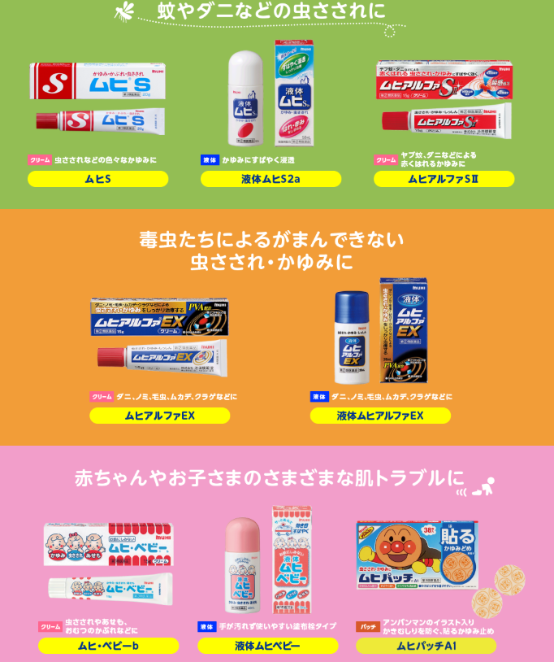
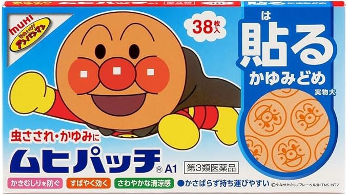

<!-- Ctrl+Shift+V -->

# 夏ですね
- あついですね

## アウトドアお好きですか
- 僕は苦手です

## やるかたはどうぞお気をつけて
- 特に普段アウトドア慣れしてない人
- 暑さもそうですが、他にも気を付けてほしいものがあります

---

# 虫の話です。
- 蚊とかですね
- 近年は暑すぎて蚊が少ないという噂もありますけどどうでしょう
- 僕の周りは特にそんなことなくて元気いっぱいな気がします

# 虫よけをちゃんとしましょう
## 塗りなおさないと効果が切れちゃうみたいですよ
- 手元にあった虫よけのパッケージ見てみたのですが、特に効果時間みたいのは書いてませんでした。
- 調べてみたところ、5-6時間くらい効果が続くものが多いようです。

---

# 怠るとなかなかしんどい目にあうかも

# 2022年の6月 キャンプ(会社のイベント)
- 前の会社です。
- 昭和の会社だったので、イベントは適度に参加しないといけない

## テントの外で寝ちゃった(虫よけはしてた)
- 慣れてないとこういうことする奴が出てくる
- 最後まで飲んでたので、どのテントも床が結構埋まってて面倒だった

## 手足を中心にものすごい数さされた
- 手足がボコボコで数える気も起きない
---

# 2022年の冬までずっとかゆかった
- 一気にたくさん刺されたのが悪かったのか、ほんとに全然治んなかった

## 春頃には落ち着いてきて治ったとおもったのですが。
- この時点で1年弱
---

# なぜかお酒を飲んだ時に限り再発してかゆくなる
- 気のせいとかじゃなくて、しっかり腫れる
- 検索が難しくて症例が探せなかった
- 各種生成AIに聞くと、よくあることらしい(ホントか？)

Claudeさん曰く
> 血流増加 - アルコールによる血管拡張で古い刺し跡の炎症が再活性化
> 免疫反応の再活性化 - 残存する異物成分に血流増加で免疫システムが再反応
> ヒスタミン放出 - アルコールがヒスタミン放出を促進し、かゆみ・腫れを誘発
> 皮膚の敏感化 - 過去の強い炎症により刺激に敏感な状態が継続 

---
# 去年の冬くらいまで続いた
- 2年半

# ホント大変だったので、皆さんはお気をつけてね

---
# とはいえ、刺されてしまったら
## いろんな薬がありますよね
---
ムヒだけでこんなに
https://www.ikedamohando.co.jp/insect-bite/

---
## ステロイド or 非ステロイド
- ステロイドは炎症を止めることでかゆみの原因を治すイメージ
- 通常のかゆみ止めの成分も含まれてる
- 強いけど長期連用は避けてね。お子様は特に。

## クリーム or 液体 or パッチ

---
# 張るタイプのやつが一番効きました。オススメです。
- こういうやつ

- 人気がないのか、あんまり種類が置いてない気がする。
- 背に腹は代えられないので、アンパンマンを貼りまくってた

<!-- 

 -->

