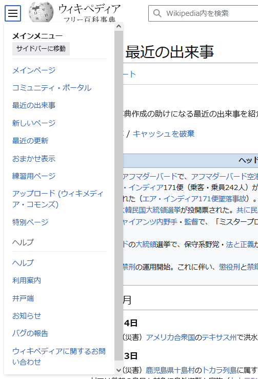

# 好きなもの

           

           

## インターネット

## wikipedia

マジメな情報源として見ることもあると思うんですが、

[秀逸な記事](https://ja.wikipedia.org/wiki/Wikipedia:%E7%A7%80%E9%80%B8%E3%81%AA%E8%A8%98%E4%BA%8B)

[良質な記事](https://ja.wikipedia.org/wiki/Wikipedia:%E8%89%AF%E8%B3%AA%E3%81%AA%E8%A8%98%E4%BA%8B)

[珍記事](https://ja.wikipedia.org/wiki/Wikipedia:%E7%8F%8D%E9%A0%85%E7%9B%AE)

ケチャップは野菜
志布志町志布志
徳川埋蔵金
豊川信用金庫事件
ネコひねり問題
ホボロ島
野球害毒論

ジャック・チャーチル